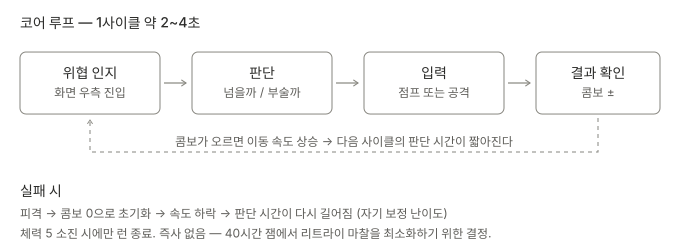
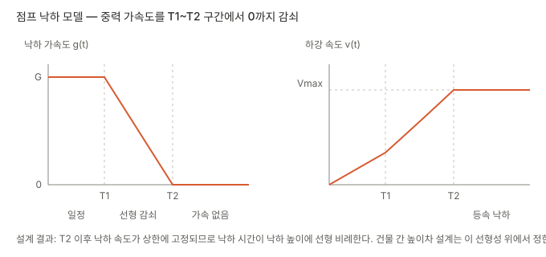
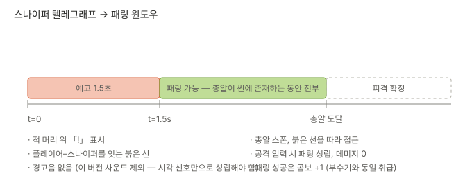
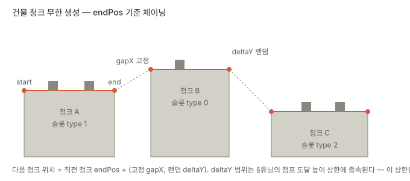
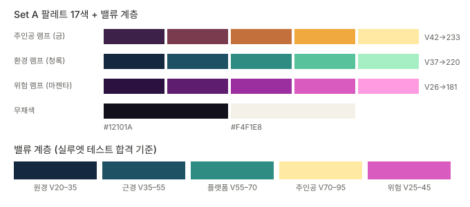

# SIGNAL RUSH — Game Design Document v0.2

> **이 문서를 읽는 사람과 에이전트에게**
>
> - 모든 오브젝트는 `OBJ-*`, 시스템은 `SYS-*`, 기능은 `F*`, 튜닝 값은 `TUNE-*` ID를 갖는다. 다른 문서·이슈·커밋에서 이 ID로 참조한다.
> - **수치는 본문에 인라인으로 쓰지 않는다.** 전부 [§6 튜닝 파라미터](#6-튜닝-파라미터)에 모여 있고 본문은 `TUNE-xx`로 가리킨다. 밸런싱 시 §6만 고치면 된다.
> - 이 문서에는 **전체 클래스 구조를 고정하지 않는다.** 구현에 필요한 최소 시그니처와 작업 순서는 저장소의 `Docs/WORK_QUEUE.md`에서 관리하며, 여기에 없는 기능을 추가하지 않는다.
> - **사운드는 이 문서의 범위 밖이다.** 모든 피드백은 시각 신호만으로 성립하도록 설계되어 있다.
> - `[미결]` 태그가 붙은 항목은 아직 결정되지 않았다. 임의로 확정하지 말고 [§9](#9-미결-항목)에서 확인한다.

---

## 1. 개요

| 항목 | 내용 |
|---|---|
| 하이 컨셉 | 배달기사가 밤의 메가시티 옥상과 건물 내부를 달리며, 장애물을 베고 저격을 튕겨내면서 배송지까지 완주한다 |
| 장르 | 2D 사이드뷰 아케이드 러너 / 플랫포머 |
| 시점 | 우측 진행 고정, 사이드뷰 |
| 세션 길이 | 1런 60~90초 |
| 세계관 | 길드가 물류회사가 된 메가시티. "기사 서약" = **30분 내 배달 완료** |
| 승리 조건 | 배송지 도달 |
| 패배 조건 | 체력 소진 |
| 조작 | 점프, 공격 — 2버튼. 좌우 이동 입력 없음 |

플레이어가 이 게임에서 반복하는 판단은 하나다. **"앞의 것을 넘을 것인가, 벨 것인가."** 넘으면 안전하지만 콤보가 오르지 않고, 베면 콤보가 오르지만 위치와 타이밍이 묶인다. 콤보가 오르면 이동 속도가 올라가서, 다음 판단에 쓸 수 있는 시간이 줄어든다.

---

## 2. 스코프 잠금 — 구현 기능 6개

40시간 / 2인 제약으로 아래 6개 외에는 **구현하지 않는다.** 이 목록은 협상 대상이 아니며, 추가하려면 무언가를 빼야 한다.

| ID | 기능 | 정의 | 완료 판정 |
|---|---|---|---|
| **F1** | 자동 전진 러너 | 플레이어가 우측으로 상시 이동한다. 좌우 이동 입력은 없으며 감가속·리스폰·화면 내 위치는 게임 시스템이 통제한다 | 입력 없이도 캐릭터가 화면 밖으로 나가지 않고 계속 전진 |
| **F2** | 점프 | 감쇠 중력 모델 기반 단일 점프 ([§4.1](#41-obj-player--플레이어)) | 최대 높이·낙하 시간이 §6 값과 일치 |
| **F3** | 공격 / 부수기 | 검을 휘둘러 장애물 파괴. 공격 판정 중에만 히트박스 활성 | 장애물이 파편으로 분해되고 콜라이더가 제거됨 |
| **F4** | 패링 | **F3과 같은 입력.** 총알 존재 중 공격 입력 시 무효화 | 패링 성공 시 피해 0, 콤보 유지 |
| **F5** | 콤보 / 아드레날린 | 파괴·패링마다 콤보 증가, 콤보에 비례해 이동 속도 상승. 피격 시 0으로 초기화 | 콤보 20에서 속도가 §6 상한과 일치 |
| **F6** | 절차적 청크 생성 | 건물 청크를 이어 붙이고 장애물 슬롯을 랜덤 배정 ([§5.3](#53-sys-spawn--절차적-생성)) | 60초 연속 주행 중 진행 불가 구간이 발생하지 않음 |

### 2.1 명시적 컷 리스트

**구현하지 않는다.** 시간이 남았을 때만 위에서부터 복구한다.

1. 슬라이딩 — 저자세 통과. 컷 사유: "낮은 장애물" 카테고리가 추가되어 F6의 슬롯 규칙이 두 배가 됨
2. 아이템 (방어막 / 로켓부츠 / 커피 / 하트 / 카타나)
3. 드론 (미사일 예고 회피형 적)
4. 헬리콥터 보스
5. 크레인 화물 등 동적 이동 장애물
6. 건물 **내부** 구간 — v0.2는 옥상 단일 레이어만

### 2.2 검토했으나 채택하지 않은 조합

| 조합 | 6기능 | 탈락 사유 |
|---|---|---|
| 회피 러너 | 러너·점프·슬라이딩·체력·타임어택·절차생성 | 전투 부재. 완성 확률은 최고지만 차별점이 없음 |
| 파괴 러너 | 러너·점프·부수기·콤보·드론·절차생성 | 액션 버브 1개. 콤보 20까지 갈 동기가 약함 |
| 보스 러너 | 러너·점프·부수기·패링·보스·고정구간 | 보스 채택 시 절차생성 포기 → 레벨 수작업으로 오히려 초과 |
| 아이템 러너 | 러너·점프·슬라이딩·체력·아이템3종·절차생성 | 아이템은 코어 버브를 증폭하는 장치인데 증폭할 버브가 없음 |

---

## 3. 예시 플레이어 시나리오

수직 슬라이스 검증용 60초 시퀀스. **이 시퀀스가 끝까지 돌아가면 게임은 완성된 것으로 간주한다.**

| 시각 | 상황 | 플레이어 행동 | 상태 변화 |
|---|---|---|---|
| 0:00 | 물류창고 옥상에서 자동 출발 | — | 체력 5 / 콤보 0 / 기본 속도 |
| 0:04 | 정면에 환풍기 1개 | 공격 | 콤보 1, 속도 +1% |
| 0:07 | 상자 3개 연속 | 연속 공격 | 콤보 4, 속도 +4% |
| 0:11 | 건물 간 간격 + 높이차 상승 | 점프 | 콤보 유지 (점프는 콤보에 영향 없음) |
| 0:16 | 배경 건물에 스나이퍼 「!」 + 붉은 선 | 1.5초 대기 후 총알 출현 시점에 공격 | **패링 성공.** 콤보 5 |
| 0:22 | 상자 2개 + 간격이 좁아진 청크 | 공격 후 즉시 점프 | 콤보 7. 속도 상승으로 입력 여유 체감 감소 |
| 0:31 | 스나이퍼 2기 동시 예고 | 첫 발 패링 실패 | **피격.** 체력 4, **콤보 0**, 속도 초기화 |
| 0:33 | 무적 프레임 중 두 번째 총알 통과 | — | 피해 없음 |
| 0:38 | 상자·환풍기 밀집 구간 | 연속 공격 | 콤보 6 재축적 |
| 0:52 | 콤보 12 도달, 속도 최고 구간 | 점프-공격 교차 입력 | 화면 스크롤 체감 최대 |
| 1:00 | 배송지 건물 진입 | 자동 정지 | **클리어.** 결과 화면: 소요 시간 / 최고 콤보 |

이 시나리오에서 확인되는 것: 실패해도 런이 끊기지 않고(0:31), 실패가 즉시 난이도를 낮춰 회복 기회를 주며(속도 초기화), 최고 콤보가 실력 지표로 남는다.

---

## 4. 오브젝트

### 4.1 OBJ-PLAYER — 플레이어

캔버스 16×16 픽셀 기준.

**상태**

| 상태 | 진입 조건 | 제어 가능 | 비고 |
|---|---|---|---|
| Run | 기본 | O | 상시 우측 전진 |
| Jump | 접지 상태에서 점프 입력 | 공격만 | 이단 점프와 좌우 이동 없음 |
| Attack | 공격 입력 | O | Run/Jump와 병행 가능. 공격 중 재입력 무시 |
| Hit | 피격 | X | 무적 프레임 부여 후 Run 복귀 |
| Dead | 체력 0 | X | 낙하 후 결과 화면 |

**점프 모델 (F2)** — 낙하 가속도가 `T1`까지 일정하다가 `T2`에서 0까지 선형 감쇠하고, 이후 등속 낙하한다.

이 모델을 쓰는 이유는 낙하 체공을 길게 유지해 공중에서 다음 착지점을 고를 시간을 주기 위해서다. **T2 이후 낙하 속도가 상한에 고정되므로 낙하 시간은 낙하 높이에 선형 비례한다.** [SYS-SPAWN](#53-sys-spawn--절차적-생성)의 높이차 범위는 이 선형성에 종속된다.

**공격 (F3 / F4)** — 단일 입력이 두 결과를 만든다.

- 공격 판정 히트박스가 **장애물** 콜라이더와 겹침 → 파괴, 콤보 +1
- 공격 입력 시점에 **총알**이 씬에 존재 → 히트박스 무관하게 패링 성립, 콤보 +1
- 둘 다 아니면 헛스윙 (패널티 없음, 다만 이동 중 판정 시간 손실)

패링이 히트박스를 무시하는 것은 의도적 단순화다. 40시간 안에서 총알 위치 판정까지 튜닝할 여유가 없고, 관대한 판정이 잼 심사 환경에서 더 잘 읽힌다.

**체력 / 피격**

- 체력 `TUNE-P4`. 피격 시 1 감소, 무적 프레임 `TUNE-P5` 부여, **콤보 0으로 초기화**
- 무적 프레임 중 스프라이트 점멸로 시각 표시
- 즉사 없음. 낙사도 이 버전에서는 체력 1 감소 후 직전 안전 지점으로 복귀 `[미결 Q3]`

### 4.2 OBJ-SNIPER — 스나이퍼

유일한 적. 배경/전경 건물 위에 배치되며 이동하지 않는다.

| 페이즈 | 지속 | 시각 신호 |
|---|---|---|
| 예고 | `TUNE-S1` | 머리 위 「!」, 플레이어–스나이퍼 연결 붉은 선 |
| 발사 | 즉시 | 총알 스폰, 붉은 선 소멸 |
| 비행 | 총알 도달까지 | 총알 궤적. **이 구간 전체가 패링 윈도우** |

- 스나이퍼는 화면에 동시 최대 `TUNE-S3`기까지만 활성화한다. 초과분은 예고를 시작하지 않는다.
- 예고 시작 시점의 플레이어 위치로 조준선을 고정한다. 추적하지 않는다 — 추적하면 회피가 불가능해지고 패링이 강제된다.
- 사운드가 없으므로 「!」 표시는 화면 밖으로 나가지 않도록 클램프하고, 붉은 선은 위험 램프 최고 채도(`#D95BC0`)를 사용해 배경과 분리한다.

### 4.3 OBJ-OBSTACLE — 장애물

| 종류 | 배치 | 크기 |
|---|---|---|
| 상자 | 옥상 바닥 | 16×16 |
| 환풍기 | 옥상 바닥 | 16×16 |
| 간판 | 옥상 가장자리 | 16×32 `[미결 Q2]` |

- 플레이어 몸통 콜라이더와 충돌 → 피격 이벤트, **장애물은 파괴되지 않고 남는다**
- 플레이어 공격 콜라이더와 충돌 → 파편 분해, 콜라이더 제거, 콤보 +1
- 파편은 물리 시뮬레이션 없이 스프라이트 3~4장 플립북으로 처리하고 일정 시간 후 소멸

피격 시 장애물이 남는 것은 중요하다. 남지 않으면 "부딪히면 자동으로 뚫린다"가 되어 공격의 존재 이유가 사라진다.

### 4.4 OBJ-CHUNK — 건물 청크

프리팹 단위 레벨 조각. 상단 표면에 `startPos` / `endPos` 두 앵커를 갖고, 장애물 배치 슬롯을 미리 정의해둔다.

- 슬롯은 `type 0 / 1 / 2` 세 세트를 프리팹마다 사전 배정 (빈 슬롯 허용)
- 청크 종류 `[미결 Q1]` — 최소 3종, 목표 5종

### 4.5 OBJ-GOAL — 배송지

마지막 청크에 고정 배치. 도달 시 플레이어 입력을 차단하고 결과 화면으로 전환한다.

---

## 5. 시스템

### 5.0 SYS-CONTROL — 2버튼 조작

- 플레이어 입력은 **점프와 공격 두 가지뿐**이다. 좌우 이동 입력은 제공하지 않는다.
- 수평 이동은 자동 전진을 기본으로 하며, 감속·가속·리스폰에 따른 위치 보정은 게임 시스템이 수행한다.
- 카메라는 플레이어를 화면 안에 유지하고 전방 판단 공간을 보장해야 한다. 구체적인 감가속·리스폰 연출은 F2/F6 안정화 이후 작업 큐에서 확정한다.
- 이 결정은 입력 수를 줄여 플레이어의 판단을 “넘을 것인가, 벨 것인가”에 집중시키기 위한 것이다.

### 5.1 SYS-COMBO — 콤보 / 아드레날린 (F5)

이 게임의 유일한 진행 곡선이다.

- 파괴 또는 패링 성공 시 콤보 +1, 상한 `TUNE-C1`
- 이동 속도 = 기본 속도 × (1 + `TUNE-C2` × 콤보)
- **피격 시 즉시 0.** 감쇠나 유예 없음
- 시간 경과에 의한 자연 감소는 **없다.** 잼 규모에서 감쇠 타이머까지 튜닝하면 난이도 곡선이 통제 불능이 된다

콤보는 난이도 조절 장치를 겸한다. 잘하는 플레이어는 빨라져서 어려워지고, 못하는 플레이어는 느려져서 쉬워진다. 별도의 난이도 램프를 만들지 않는 이유다.

### 5.2 SYS-HEALTH — 체력 / 무적

- 체력 `TUNE-P4`에서 시작, 회복 수단 없음 (하트 아이템은 컷)
- 피격 → 무적 `TUNE-P5` → Run 복귀
- 무적 중에는 모든 피격 판정을 무시하되 **공격과 패링은 정상 동작**한다

### 5.3 SYS-SPAWN — 절차적 생성 (F6)

**절차**

1. 다음 청크 프리팹을 후보 중 랜덤 선택
2. 배치 위치 = 직전 청크 `endPos` + (고정 `TUNE-G1`, 랜덤 `TUNE-G2` 범위 내 높이차)
3. 해당 청크의 슬롯 타입을 `0/1/2` 중 랜덤 선택하여 장애물 인스턴스화
4. 스나이퍼 배치 확률 `TUNE-G3` 판정
5. 카메라 뒤로 `TUNE-G4` 이상 벗어난 청크는 파괴

**불변 조건 (반드시 검증)**

- 높이차 상한은 §6의 점프 최대 도달 높이에서 안전 마진을 뺀 값을 **절대 초과하지 않는다.** 클램프 없이 랜덤 범위만 조정하는 방식은 금지 — 확률 낮은 진행 불가 구간이 심사 중에 터진다
- 청크 간 수평 간격은 최고 속도(콤보 20) 기준으로도 점프로 넘을 수 있어야 한다. 속도가 올라가면 도달 거리가 늘어나므로 이쪽은 최저 속도 기준이 제약이다
- 스나이퍼 예고 중에 그 스나이퍼가 소속된 청크가 파괴되지 않도록 한다

**난이도 진행** — v0.2에서는 청크 난이도 램프를 넣지 않는다. 속도 상승(SYS-COMBO)이 난이도 상승을 대신한다.

### 5.4 SYS-RUN — 런 진행 / 결과

- 시작: 물류창고 옥상, 체력 `TUNE-P4`, 콤보 0
- 종료: 배송지 도달(클리어) 또는 체력 0(실패)
- 결과 화면 표시 항목: **소요 시간 / 최고 콤보 / 파괴 수**
- 재시작은 결과 화면에서 1키

### 5.5 SYS-CAMERA — 카메라

- Cinemachine 2D, 플레이어를 화면 좌측 `TUNE-M1` 지점에 고정 추적
- 데드존을 세로로 넓게 잡아 점프 시 화면이 흔들리지 않게 한다
- Pixel Perfect Camera와 함께 사용 — 서브픽셀 이동으로 인한 지터를 방지하기 위해 카메라 추적 결과를 픽셀 그리드에 스냅한다

---

## 6. 튜닝 파라미터

**모든 수치는 여기에만 존재한다.** 미확정 값은 잼 당일 플레이 테스트로 채운다.

| ID | 항목 | 초기값 | 범위 | 비고 |
|---|---|---|---|---|
| TUNE-P1 | 기본 이동 속도 | `[미정]` | — | 픽셀/초, PPU 확정 후 산출 |
| TUNE-P2 | 점프 감쇠 시작 `T1` | `[미정]` | 0.1–0.3s | |
| TUNE-P3 | 점프 감쇠 종료 `T2` | `[미정]` | 0.3–0.6s | T1 < T2 필수 |
| TUNE-P4 | 최대 체력 | 5 | 3–5 | |
| TUNE-P5 | 무적 프레임 지속 | 1.0s | 0.8–1.5s | |
| TUNE-P6 | 공격 판정 지속 | `[미정]` | 0.1–0.2s | 애니메이션 길이와 일치시킬 것 |
| TUNE-C1 | 콤보 상한 | 20 | 고정 | |
| TUNE-C2 | 콤보당 속도 증가율 | 0.01 | 0.005–0.02 | 상한에서 총 +20% |
| TUNE-S1 | 스나이퍼 예고 시간 | 1.5s | 1.0–2.0s | 사운드 없으므로 짧추면 위험 |
| TUNE-S2 | 총알 속도 | `[미정]` | — | 예고 후 도달까지 최소 0.5s 확보 |
| TUNE-S3 | 동시 활성 스나이퍼 수 | 2 | 1–3 | |
| TUNE-G1 | 청크 수평 간격 | `[미정]` | — | 최저 속도 기준 점프 도달 거리 이내 |
| TUNE-G2 | 청크 높이차 범위 | `[미정]` | — | **점프 최대 높이 − 마진으로 클램프 필수** |
| TUNE-G3 | 스나이퍼 배치 확률 | 0.35 | 0.2–0.5 | 청크당 |
| TUNE-G4 | 청크 파괴 거리 | `[미정]` | — | 카메라 좌측 밖 |
| TUNE-M1 | 카메라 내 플레이어 X 위치 | 화면 30% | 25–35% | 전방 시야 확보 |
| TUNE-R1 | 목표 런 길이 | 75s | 60–90s | |

---

## 7. 아트 방향성

전체 아트 바이블은 `게임잼_온보딩_플레이북.md` §8을 정본으로 하고, 여기서는 게임 디자인과 직결되는 부분만 남긴다.

- **픽셀 퍼펙트 픽셀아트.** 주인공 기준 16×16, 플랫 셀셰이딩, 굵고 균일한 아웃라인
- 팔레트 17색은 `PaletteSetA.cs`의 ScriptableObject로 프로젝트에 고정한다
- **밸류 계층이 곧 게임플레이 정보다.** 주인공이 화면 내 최고 명도를 독점하고, 원경은 좁은 저명도 대역에 묶인다
- 위험 램프는 명도 상한이 주인공보다 낮으므로 **위험 요소 뒤에는 반드시 근경(V35–55)을 배치**해 명도차를 확보한다. 원경 위에 놓으면 읽히지 않는다
- **실루엣 테스트**: 플레이 스크린샷을 흑백 변환 + 20% 축소해서 플레이어 / 장애물 / 배경이 구분되지 않으면 그 청크는 반려한다

### 7.1 사운드 부재에 대한 시각 보상

이 버전에는 사운드가 없다. 원래 청각으로 전달했을 정보를 시각으로 옮겨야 한다.

| 이벤트 | 시각 신호 |
|---|---|
| 스나이퍼 예고 | 「!」 + 붉은 연결선 + 선의 굵기 점진 증가 |
| 패링 성공 | 화면 짧은 플래시 + 총알 반사 스프라이트 |
| 장애물 파괴 | 파편 플립북 + 미세 화면 흔들림 |
| 피격 | 스프라이트 점멸 + 콤보 카운터 낙하 애니메이션 |
| 콤보 상승 | HUD 카운터 스케일 펀치 (DOTween) |

---

## 8. UI / HUD

최소 구성. 화면 정보량을 늘리지 않는다.

| 요소 | 위치 | 내용 |
|---|---|---|
| 체력 | 좌상단 | 하트 5칸 |
| 콤보 | 좌상단 하단 | 숫자 + 배수 표기 |
| 진행도 | 상단 중앙 | 배송지까지의 바 |
| 결과 화면 | 전체 | 소요 시간 / 최고 콤보 / 파괴 수 / 재시작 안내 |

타임어택 표기는 **남은 시간이 아니라 경과 시간**으로 한다. 제한 시간을 두면 F6의 청크 길이와 결합해 조기 실패가 발생하고, 잼 심사에서 리트라이 마찰이 커진다.

---

## 9. 미결 항목

| ID | 내용 | 결정 기한 | 결정권 |
|---|---|---|---|
| Q1 | 청크 프리팹 종류 수 (최소 3, 목표 5) | 잼 12시간차 | 아트 담당 |
| Q2 | 간판(16×32) 장애물을 v0.2에 포함할지 | 잼 8시간차 | 프로그래밍 담당 |
| Q3 | 낙사 처리 — 체력 1 감소 후 복귀 vs 즉사 | 첫 플레이 테스트 직후 | 공동 |
| Q4 | Pixels Per Unit 표준값 | 첫 스타일 앵커 승인 시 | 아트 담당 |
| Q5 | 파편 스프라이트를 장애물별로 나눌지 공용 1종으로 갈지 | 잼 20시간차 | 아트 담당 |

---

## 10. 작업 규칙 (요약)

전체 규칙은 `게임잼_온보딩_플레이북.md`가 정본이다. 아래는 이 문서 범위에서 반복 확인이 필요한 것만 추린 것이다.

**씬 소유권** — 컨셉 확정 직후 담당 씬을 팀 채널에 한 줄로 고정한다. 타인 담당 씬은 명시적 합의 전까지 건드리지 않는다. 프리팹처럼 여러 씬이 공유하는 애셋은 미리 알리고 짧게 작업한 뒤 즉시 커밋·푸시한다. 충돌 시 자동 병합을 시도하지 않고 최근 커밋 기준으로 변경분을 수동 재적용한다.

**Git** — trunk-based, main 직커밋, LFS 미사용. 작업 시작 전 항상 pull. 커밋은 작게 자주.

**코딩 컨벤션** — 클래스/메서드/public 프로퍼티 PascalCase, private 필드 `_camelCase`, 지역변수 camelCase, 인터페이스 `IPascalCase`. private 필드는 `[SerializeField] private`로 노출하고 public 필드는 쓰지 않는다. 한 파일에 한 클래스, Unity 이벤트 함수는 클래스 최상단에 순서대로. `Update()`에서 `GetComponent` / `Find` 금지 — 캐싱. 매직 넘버 금지 — §6의 값은 전부 직렬화 필드나 상수로.

**애셋** — 알파 채널 보존 및 `Alpha Is Transparency` 설정. 원본 캔버스 크기를 조정하지 않고 내부에서만 색 조정. 원본 파일 덮어쓰기 금지 — 별도 폴더에 같은 파일명으로 익스포트하여 GUID/메타파일 유지. 스프라이트 임포트는 Filter Mode `Point`, Compression `None`.

**AI 애셋** — PixelLab로 생성, Aseprite로 보정. 오브젝트별 앵커 애셋을 먼저 확정하고 나머지는 그 레퍼런스로 생성한다. **시드를 고정한다.** 팔레트는 그림이 아닌 것에서, 셰이프 랭귀지는 건축·산업디자인에서, 재질감은 공예·인쇄 기법에서 각각 독립적으로 가져온다. 생성 결과는 개별 팔레트 정합 → 전체 룩 매칭 → 글로벌 볼륨 순으로 보정한다.

---

## 11. 후속 설계 범위

- 타입 정의 및 함수 시그니처
- 상태 머신 전이표 (OBJ-PLAYER)
- 프리팹 계층 구조 및 컴포넌트 배치
- 컷 리스트 복구 우선순위에 따른 기능 추가 명세
- 사운드 설계 (별도 문서)
